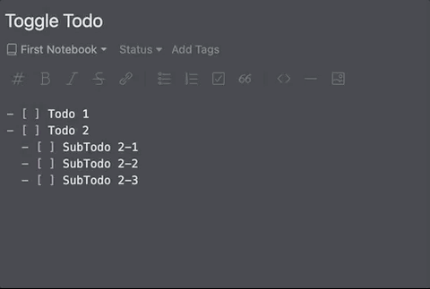

# Todo Support Plugin for Inkdrop



This plugin supports to add a keyboard shortcut for toggling todo list item for the current cursor line.

## Install

```
ipm install todo-support
```

## Usage

The following commands are available:

| Command                          | Description                   | Default keybinding                                                                       |
| -------------------------------- | ----------------------------- | ---------------------------------------------------------------------------------------- |
| `todo-support:mark`              | Toggle todo mark              | <kbd>Ctrl</kbd> + <kbd>Enter</kbd>                                                       |

Customizing the keybindings is documented [here](https://docs.inkdrop.app/manual/customizing-keybindings).
The `todo-support:mark` command should be bound to the `.CodeMirror textarea` selector.

## Changelog

See the [GitHub releases](https://github.com/gotchane/inkdrop-todo-support/releases) for an overview of what changed in each update.