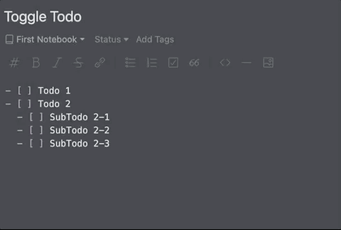

# Todo Support Plugin for Inkdrop



This plugin supports to add a keyboard shortcut for toggling todo list item for the current cursor line.

Toggling only rewrites the mark inside the brackets, so your bullet character and
spacing are left exactly as you wrote them.

> **Note**
> This is not the same as Inkdrop's built-in `core:toggle-task-list`, which turns a
> line into (or out of) task list syntax. This plugin flips the checked state of a
> task that already exists.

## Requirements

Inkdrop **v6.0.0 or later**. Inkdrop v6 rebuilt its editor on CodeMirror 6, so this
version of the plugin does not work on v5 — Inkdrop v5 users are served v0.2.1.

## Install

```
ipm install todo-support
```

## Usage

The following commands are available:

| Command             | Description      | Default keybinding                     |
| ------------------- | ---------------- | -------------------------------------- |
| `todo-support:mark` | Toggle todo mark | <kbd>Ctrl</kbd> + <kbd>Enter</kbd>     |

Customizing the keybindings is documented [here](https://docs.inkdrop.app/reference/key-customizations).
The `todo-support:mark` command should be bound to the `.cm-editor .cm-scroller` selector.

## Development

```
npm install
npm test
```

## Changelog

See the [GitHub releases](https://github.com/gotchane/inkdrop-todo-support/releases) for an overview of what changed in each update.
